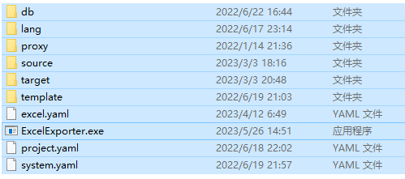
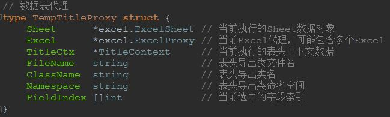
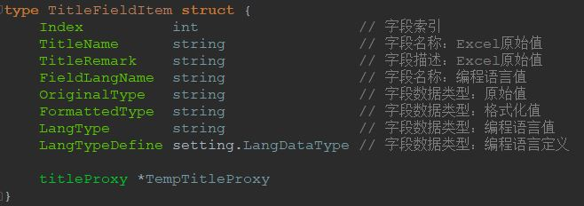
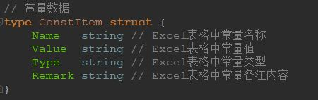
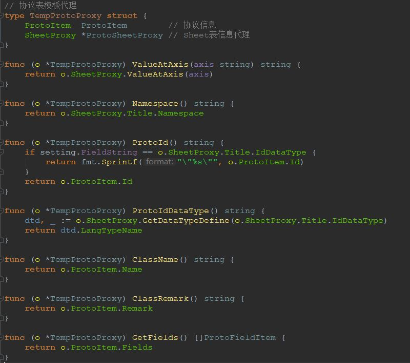
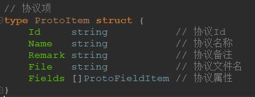
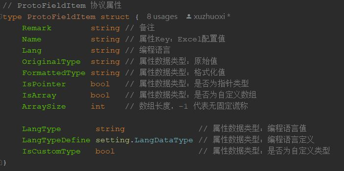
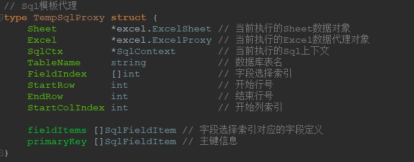
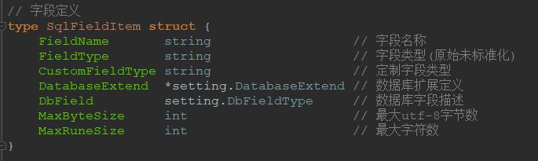

# ExcelExporter  
一个用于导出Excel数据的工具。  
根据模板导出Excel数据。支持**多种数据格式**和**任何一种编程语言**。支持**多操作系统**。  

中文 | [English](/README_EN.md)  

## 1. 兼容性
go 1.16.15  

## 2. 如何获取
可以通过以下两种方式获取到ExcelExporter工具：  

#### 2.1. 从Release中下载。  
  [下载页面](https://github.com/xuzhuoxi/ExcelExporter/releases)  
+ 下载相应平台的执行文件。  
+ 下载环境配置  

#### 2.2. 下载源码进行编译。
下载github源码仓库进行编译。 步骤如下：  
1. 执行如下命令，获取源代码仓库工程。   
```
go get -u github.com/xuzhuoxi/ExcelExporter
```
2. 编译工程。  
+ Windows下执行[goxc_build.bat](/build/goxc_build.bat)  
+ Linux或MacOS下执行[goxc_build.sh](/build/goxc_build.sh)  

##  3. 开始

#### 3.1. 环境准备
1. 解压evn.zip到本地，并清理soruce中的测试文件。  
2. 复制执行文件到evn目录中。  
   Windows下目录结构如下：  
     
3. 执行命令。

#### 3.2. 执行命令
```
ExcelExporter -env=%env% -mode=title,data,const,proto -range=client,server,db -lang=as3,c#,go,java,ts -file=json,bin,sql -merge=false -source==源路径 -target=导出路径
```

**示例**：  
1. 导出client范围下的表头与数据，使用的编程语言的c#，数据文件导出为json.
```shell
ExcelExporter -mode=client range=client -lang=c# -file=json
```
2. 导出db范围下的sql表脚本以及sql数据脚本，并合并
```shell
ExcelExporter -mode=title,data -range=db -file=sql -merge=true
```
3. 导出client范围下的常量表及协议表文件，使用编程语言为go。
```shell
ExcelExporter -mode=const,proto -range=client -lang=go
```

#### 3.3.参数说明(带\*为必要参数)

- -env  
  + 作用：重新指定环境配置。  
  + 可选：不指定则使用执行文件目录下的环境配置  

- **-mode \***  
  + 作用：指定运行的模式，多个模式可用英文逗号","分隔  
  + 支持：  
    + title:   
      表头导出  
      后续参数要求：-range、-lang、-file、-merge  
    + data:   
      数据导出  
      后续参数要求：-range、-file、-merge   
    + const：  
      常量表导出  
      后续参数要求：-range、-lang  
    + proto：  
      协议表导出  
      后续参数要求：-range、-lang  

- **-range \***
  + 作用：指定表头或数据导出时字段范围或过滤协议
  + **支持值**：client, server, db  
  + **适用模式**：title、data、const、proto  
    + title、data
      指定表头或数据导出时字段范围。  
      指定导出文件的关联目录。
    + const
      指定导出文件的关联目录。
    + proto
      选择要导出的协议表。
      指定导出文件的关联目录。

- **-lang \***  
  + 作用：指定相关的编译语言，多个可用英文逗号","分隔  
  + **支持值**：as3、c#、go、java、ts  
  + **适用模式**：title、const、proto   

- -file  
  + 作用：指定导出的数据文件的格式类型，多个可用英文逗号","分隔  
  + **支持值**：json、bin、sql  
  + 未完善的支持值：  yaml, toml, hcl, env, properties  
  + **适用模式**：title、data   

- -merge  
  + 作用：当-file包含sql时，指定导出的sql脚本是否合并。默认flase。  
  + **支持值**：true、false  

- -source  
  + 作用：指定运行时的Excel表来源目录，用于覆盖配置文件project.yaml中source.value的值  
  + **适用模式**：title、data、const、proto  

- -target  
  + 作用：指定运行时的文件产出目录，用于覆盖配置文件project.yaml中target.value的值  
  + **适用模式**：title、data、const、proto  

## 4. 配置文件

### 4.1. 环境目录及文件说明
<pre><code>.配置根目录
├── db: 数据库相关配置与sql模板
│   ├── mysql.yaml: mysql信息配置
│   ├── mysql_table.temp: mysql建表模板
│   ├── mysql_data.temp: mysql插入数据模板
│   ├── ...: 其它扩充
├── lang: 编程语言相关配置
│   ├── as3.yaml: 针对ActionScript3，不同数据文件下各基础数据类型的读写语法配置
│   ├── c#.yaml: 针对c#，不同数据文件下各基础数据类型的读写语法配置
│   ├── c++.yaml: 针对c++，不同数据文件下各基础数据类型的读写语法配置
│   ├── go.yaml: 针对golang，不同数据文件下各基础数据类型的读写语法配置
│   ├── java.yaml: 针对java，不同数据文件下各基础数据类型的读写语法配置
│   ├── ts.yaml: 针对typescript，不同数据文件下各基础数据类型的读写语法配置
│   ├── ...: 其它编程语言下，不同数据文件下各基础数据类型的读写语法配置
├── proxy: 代理代码集(非必要)
│   ├── as: ActionScript3相关的代理代码集
│   ├── go: golang相关的代理代码集
│   ├── java: java相关的代理代码集 
│   ├── ts: TypeScript相关的代理代码集
│   ├── ...: 其它编程语言相关的代理代码集
├── templates: 模板文件目录，只支持golang模板语法
│   ├── as3_const.temp: ActionScript3语言下，常量定义模板
│   ├── as3_proto.temp: ActionScript3语言下，协议定义模板
│   ├── as3_title.temp: ActionScript3语言下，Title定义模板
│   ├── c#_const.temp: C#语言下，常量定义模板
│   ├── c#_proto.temp: C#语言下，协议定义模板
│   ├── c#_title.temp: C#语言下，Title定义模板
│   ├── go_const.temp: golang语言下，常量定义模板
│   ├── go_proto.temp: golang语言下，协议定义模板
│   ├── go_title.temp: golang语言下，Title定义模板
│   ├── java_const.temp: java语言下，常量定义模板
│   ├── java_proto.temp: java语言下，协议定义模板
│   ├── java_title.temp: java语言下，Title定义模板
│   ├── ts_const.temp: TypeScript语言下，常量定义模板
│   ├── ts_proto.temp: TypeScript语言下，协议定义模板
│   ├── ts_title.temp: TypeScript语言下，Title定义模板
│   ├── ...: 其它语言下，常量定义模板与Title定义模板
├── source: 默认Excel文件存放目录
├── target: 默认Excel文件存放目录
├── excel.yaml: Excel的表头配置，包括数据表头配置、常量表头配置
├── project.yaml: 项目配置，包括数据源配置、数据输出配置、缓冲配置、大小端配置等
├── system.yaml: 应用配置，包括支持的编程语言配置(扩展名、读写配置、模板关联等)、数据字段类型配置、数据文件配置等
</code></pre>

### 4.2 [System配置](./res/system.yaml)  
负责基本功能相关的配置：[system.yaml](./res/system.yaml)  

#### 4.2.1 职能范围  
1. 编程语言信息配置  
   + 扩展名配置
   + 数据类型读写行为配置  
   + 相关导出模板配置  
2. 数据库信息配置  
   + 数据库字段类型映射文件配置  
   + 数据库建表脚本的模板配置  
   + 数据库数据脚本的模板配置  
3. 基础数据类型配置  
4. 导出数据文件格式配置  

#### 4.2.2 定制场合
以下几种情况，你应该修改 [system.yaml](./res/system.yaml)  
+ 扩展或修改编程语言  
+ 扩展或修改数据库  
+ 扩展要支持基础数据类型  
+ 扩展要支持的数据文件格式  

### 4.3 [Project配置](./res/project.yaml)
负责项目相关的配置：[project.yaml](./res/project.yaml)  

#### 4.3.1 职能范围
1. 数据源配置，包括目录、扩展名等
2. 导出信息配置，包括：
   + 导出根目录配置
   + title、data、const、proto模式下针对client、server、db三种字段范围的导出子目录配置
   + 导出sql时子目录配置。 
3. 处理时缓存设置

#### 4.3.2 定制场合
以下几种情况，你应该修改 [project.yaml](./res/project.yaml)    
+ Excle目录不只一个，并希望在同一条命令处理。可以扩展source.value的路径。  
+ 在命令行中不提供-source参数，又希望自定义excel的源目录，可以修改source.value的路径。  
+ 希望自定义文件的输入路径，可以修改target内的属性  

### 4.4 [Excel配置](./res/excel.yaml)
负责Excel相关的配置： [excel.yaml](./res/excel.yaml)  

#### 4.4.1 职能范围
1. 自定义文件名前缀，用于处理时忽略
2. title和data模式下excel表配置
   + prefix：启用前缀配置，针对title和data模式加入处理。
   + outputs：导出信息配置，针对client、server、db三种范围，在Sheet中的导出信息坐标
   + sql：导出信息配置，针对db导出sql文件时，在Sheet中的导出信息坐标
     + key: 主键信息坐标
     + table: 表名信息坐标
     + file: 脚本文件名信息坐标
   + control_row：**控制行** 行号，用于管理字段的处理范围(字段数量)
   + nick_row：**字段昵称** 行号，方便模板中查找指定单元格式信息。
   + name_row：**字段名称** 行号
   + remak_row：**字段备注** 行号
   + range_row：**字段适用范围** 行号, 针对-range参数作匹配
   + data_type_row：**字段数据类型** 行号，适用于system.yaml中的field_datatypes中的值 
   + sql_data_type_row：用于sql的数据类型 行号
   + ext_name_rows：编程语言专用字段名称 行号
   + file_key_rows：数据文件专用字段名称 行号
   + data_start_axis：**数据开始** 坐标   
3. const模式下excel表配置
   + prefix：**启用前缀**，针对const模式加入处理。
   + outputs：**导出信息**，针对client、server两种字段范围，在Sheet中的导出信息坐标
   + name_col：**常量名** 列号
   + value_col：**常量值** 列号
   + type_col：**常量值类型** 列号
   + remark_col：**常量注释** 列号
   + data_start_row：**开始行号**
4. proto模式下excel表配置
   + prefix：**启用前缀**，针对proto模式加入处理。
   + id_datatype：**协议Id的数值类型信息**坐标，建议使用int32或string.
   + range_name：**适用范围信息**坐标，针对-range参数作匹配
   + namespace：**命名空间信息**坐标
   + export：**导出子目录信息**坐标
   + id_col：**Id信息**列号
   + file_col：**导出文件名信息**列号
   + name_col：**导出类名信息**列号
   + field_start_col：**属性开始列号**
   + data_start_row：**协议数据开始行号**
   + remark_offset：**协议备注偏移值**
   + blank_break：**是否空行中断**

#### 4.4.2 定制场合
以下几种情况，你应该修改[excel.yaml](./res/excel.yaml)  
+ 自定义Excel源目录路径
+ 过滤源目标中部分Excel文件，使之不参与处理。
+ 调整导出信息所在Sheet中的位置，包括目录、文件名、命名空间等。

### 4.5 编程语言配置  
以下以go语言作为说明。  

#### 4.5.1 语言配置
+ 配置文件位置  
  + 默认情况下，编程语言的配置位于[res/lang](./res/lang)目录下。  
  + 由[system.yaml](./res.system.yaml)中languages每一项的ref路径进行关联。  
  + 例如：go语言配置位于[res/lang/go.yaml](./res/lang/go.yaml)。  
+ 配置属性说明
  + lang_name：语言名称
  + data_types:：数据类型配置
    + name： 数据类型名称
    + operates: 数据类型操作方法名
      + file_name： 数据文件名
      + get： 取值方法
      + set： 设值方法
+ 在[system.ymal](./res/system.yaml)中field_datatypes属性包含的类型类型，在配置中data_types中都言配置上。

#### 4.5.2 模板配置
+ 模板文件位置  
  + 默认情况下，编程语言的配置位于[res/template](./res/template)目录下。  
  + Title模板由 system.yaml 中 languages 每一项的 temps_title 路径进行关联。  
  + Const模板由 system.yaml 中 languages 每一项的 temps_const 路径进行关联。  
  + Proto模板由 system.yaml 中 languages 每一项的 temps_proto 路径进行关联。  
  + 例如go语言模板如下：
    + go_const.temp：[res/template/go_const.temp](./res/template/go_const.temp)  
    + go_proto.temp：[res/template/go_proto.temp](./res/template/go_proto.temp)  
    + go_title.temp：[res/template/go_title.temp](./res/template/go_title.temp)  
- golang语法支持下的模板文件，帮助可查看[**https://golang.google.cn/pkg/text/template/**](https://golang.google.cn/pkg/text/template/)  

### 4.6 数据库配置说明  
以下以mysql数据库作为说明。 

#### 4.6.1 配置
+ 配置文件位置
  + 默认情况下，编程语言的配置位于[res/db](./res/db)目录下。  
  + mysql.yaml为数据配置文件，由 system.yaml 中 databases.list.ref 关联。  
+ 配置属性说明
  + db_name: 数据库名称
  + scale_char： Char字符比例
  + scale_varchar：Varchar字符比例
  + types： 数据库数据类型描述

#### 4.6.2 模板
+ 模板文件位置  
  + 默认情况下，编程语言的配置位于[res/db](./res/db)目录下。  
  + [mysql_data.temp](./res/db/mysql_data.temp)为数据脚本模板，由 system.yaml 中 databases.list.temps_data 关联。  
  + [mysql_table.temp](./res/db/mysql_table.temp) 为建表脚本模板，由 system.yaml 中 databases.list.temps_table 关联。
+ golang语法支持下的模板文件，帮助可查看[**https://golang.google.cn/pkg/text/template/**](https://golang.google.cn/pkg/text/template/)  

## 5. 功能

+ 四种基础导出功能：
  + [**表头导出**](#5.1表头导出)，对应命令参数 `-mode=title`   
  + [**数据导出**](# 5.2 数据导出) ，对应命令参数 `-mode=data`  
  + [**常量表导出**](#5.3 常量表导出)，对应命令参数 `-mode=const`  
  + [**协议导出**](#5.4 协议导出) ，对应命令参数 `-mode=proto`  
+ 特殊导出功能：
  + [**Sql导出**](#5.5 Sql导出)，对应 `-mode=title`或 `-mode-data`时，`-fiel=sql`

### 5.1表头导出
把Excel文件中的表头信息导出为对应语言的数据结构或类  

#### 5.1.1 表头导出处理流程
1. 遍历源目录中每一个符合的Excel文件。
    + 源目录由project.yaml中的soruce.value列表给出。  
    + 可以通过-source参数重新指定源目录。  
    + 根据project.yaml中soruce.ext_name列表进行匹配。  
2. 遍历Excel文件中匹配的的Sheet。
    + 根据excel.yaml中的title&data.prefix属性进行匹配。  
3. 根据-range参数选择对应字段列表。
    + -range参数支持client,server,db三种类型，详细请[查看]()。  
4. 根据-lang参数，选择对应语言的配置及导出模板。
    + -lang参数支持go, as3, ts, java, c#，详细请[查看]()。  
5. 字段列表 => 数据结构或类的字段或属性。
6. 相应文件全生成到目标目录中。  
    + 目标根目录由project.yaml中的target.root列表给出。  
    + 表头输出目录中project.yaml中的target.title给出，为target.root的相对路径。  
    + 可以通过-target参数重新指定源目录。  
    + 根据-range参数的内容，文件分别生成到project.yaml中target.title.client、target.title.server、target.title.database对应的目录中去。  

#### 5.1.2 表头模板说明
1. 注入的数据对象为 [\*TempTitelProxy](/src/core/context_title.go)  
   + 可通过`{{.}}`、`{{$proxy := .}}`这类模板语法取得，结构定义为：  
        

   + 常用于模板的公开属性或函数：  
     + Excel : [\*excel.ExcelProxy](/src/core/excel/proxy.go)
       当前执行的Excel数据代理对象
     + Sheet : [\*excel.ExcelSheet](/src/core/excel/sheet.go)  
       当前执行的Sheet数据对象 
     + TitleCtx : [\*TitleContext](/src/core/context_title.go)  
       当前执行的表头上下文数据  
     + FileName : string  
       表头导出类文件名  
     + ClassName : string  
       表头导出类名  
     + Namespace : string  
       表头导出类命名空间  
     + FieldIndex : []int  
       当前选中的字段索引  
     + ValueAtAxis : string  
       取当前Sheet上指定单元格的值  
     + GetFields : \[\][TitleFieldItem](/src/core/context_title.go)  
       取得字段信息数组  

2. 由 GetFields 获的字段对象为 [TitleFieldItem]((/src/core/context_title.go)
   + 结构定义
       

   + 常用于模板的公开属性或函数  
     + Index : int
       字段索引  
     + TitleName : string  
       字段名称：Excel原始值  
     + TitleRemark : string  
       字段描述：Excel原始值  
     + FieldLangName : string  
       字段名称：编程语言值  
     + OriginalType : string  
       字段数据类型：原始值  
     + FormattedType : string  
       字段数据类型：格式化值  
     + LangType : string 
       字段数据类型：编程语言值  
     + LangTypeDefine: [setting.LangDataType](./src/setting/system_lang.go)
       字段数据类型：编程语言定义

3. [自定义函数](#5.6.1 自定义函数)  

### 5.2 数据导出
- 支持的数据导出格式：bin(二进制), json, sql。  
- yaml, toml, hcl, env, properties数据导出时，字段名称会**强制处理**为小写，本意要求**大小写相关**，默认不开放  
- 要开放yaml等数据导出，请修改system.yaml文件，在"datafiel_formats"列表中补充。 

### 5.3 常量表导出

#### 5.3.1 常量表导出处理流程
1. 遍历源目录中每一个符合的Excel文件。
   + 源目录由project.yaml中的soruce.value列表给出。  
   + 可以通过-source参数重新指定源目录。  
   + 根据project.yaml中soruce.ext_name列表进行匹配。  
2. 遍历Excel文件中匹配的的Sheet。
   + 根据excel.yaml中的const.prefix属性进行匹配。  
   + 根据excel.yaml中的name_col、value_col、type_col、remark_col, 定位常量的名称、值、类型、注释。  
   + 根据excel.yaml中的data_start_row开始向下描述数据，直到最后一行结束，遇空行忽略。   
3. 根据-lang参数，选择对应语言的配置及导出模板。
   + -lang参数支持go, as3, ts, java, c#，详细请[查看]()。  
4. 相应文件全生成到目标目录中。
   + 目标根目录由project.yaml中的target.root列表给出。  
   + 常量表输出目录中project.yaml中的target.const给出，为target.root的相对路径。  
   + 可以通过-target参数重新指定根目录。  
   + 根据-range参数的内容，文件分别生成到project.yaml中target.const.client、target.const.server对应的目录中去。  

#### 5.3.2 常量表导出模板说明
1. 注入的数据对象为[\*TempConstProxy](/src/core/context_const.go)  
   + 可通过`{{.}}`、`{{$proxy := .}}`这类模板语法取得，结构定义为：  
   

   + 常用于模板的公开属性或函数：
     - Excel : [\*excel.ExcelProxy](/src/core/excel/proxy.go)  
       当前执行的Excel数据代理对象  
     - Sheet : [\*excel.ExcelSheet](/src/core/excel/sheet.go)  
       当前执行的Sheet数据对象  
     - ConstCtx : [\*ConstContext](/src/core/context_const.go)  
       当前执行的上下文数据  
     - FileName : string  
       导出文件名称  
     - ClassName : string  
       导出常量类名  
     - Namespace : string  
       导出类名的命名空间名称  
     - StartRow : int  
       数据开始行号  
     - EndRow : int  
       数据结束行号  
     - ValueAtAxis : string  
       取当前Sheet上指定单元格的值  
     - GetItems : \[\][ConstItem](/src/core/context_const.go)  
       取得字段信息数组  
2. 由 GetItems 获的字段对象为 [ConstItem]((/src/core/context_const.go)
   + 结构定义
       

   + 常用于模板的公开属性或函数  
     + Name : int
       Excel表格中常量名称  
     + Value : string  
       Excel表格中常量值, 字符串已经加双引号处理  
     + Type : string  
       Excel表格中常量类型  
     + Remark : string  
       Excel表格中常量备注内容  
   
3. [自定义函数](#5.6.1 自定义函数)  

### 5.4 协议表导出

#### 5.4.1 协议表导出处理流程
1. 遍历源目录中每一个符合的Excel文件。
   + 源目录由project.yaml中的soruce.value列表给出。  
   + 可以通过-source参数重新指定源目录。  
   + 根据project.yaml中soruce.ext_name列表进行匹配。  
2. 遍历Excel文件中匹配的的Sheet。
   + 根据 excel.yaml 中的 proto.prefix 属性进行匹配。  
   + 根据 excel.yaml 中的 proto.id_col、proto.field_start_col, 定位协议的Id、开始属性。  
   + 根据 excel.yaml 中的 proto.data_start_row 开始向正描述数据，直到遇到空行结束。   
3. 根据-lang参数，选择对应语言的配置及导出模板。
   + -lang参数支持go, as3, ts, java, c#，详细请[查看]()。  
4. 相应文件全生成到目标目录中。
   + 目标根目录由project.yaml中的target.root列表给出。  
   + 常量表输出目录中project.yaml中的target.proto给出，为target.root的相对路径。  
   + 可以通过-target参数重新指定根目录。  
   + 根据-range参数的内容，文件分别生成到project.yaml中target.prot.client、target.proto.server对应的目录中去。  

#### 5.4.2  协议表导出模板说明
1. 注入的数据对象为[\*TempProtoProxy](/src/core/context_proto.go)  
   + 可通过`{{.}}`、`{{$proxy := .}}`这类模板语法取得，结构定义为：  
     
     

   + 常用于模板的公开属性或函数：
     - ProtoItem : [\*ProtoItem](src/core/context_proto.go)  
       当前执行的Excel数据代理对象  
     + SheetProxy : [\*ProtoSheetProxy](src/core/context_proto.go)  
       当前执行的Sheet数据对象  
     + ValueAtAxis : string  
       取当前Sheet上指定单元格的值  
     + Namespace : string  
       导出类的命名空间名称  
     + ProtoId : string  
       协议Id  
     + ProtoIdDataType : string  
       协议Id对应的数据类型  
     + ClassName : string  
       导出类名  
     + ClassRemark : string  
       导出类名  
     + GetFields : \[\][ProtoFieldItem](/src/core/context_proto.go)  
       取得字段信息数组  
   
2. 由 GetItems 获的字段对象为 [ProtoFieldItem]((/src/core/context_const.go)
   + 结构定义
       

   + 常用于模板的公开属性或函数  
     + Remark : int
       备注  
     + Name : string  
       属性Key：Excel配置值  
     + OriginalType : string  
       属性数据类型：原始值  
     + FormattedType : string  
       属性数据类型：格式化值  
     + LangType : string  
       属性数据类型：编程语言值  
     + LangTypeDefine : string  
       属性数据类型：编程语言定义  
     + IsCustomType : string  
       属性数据类型：是否为自定义类型  

3. [自定义函数](#5.6.1 自定义函数)  

### 5.5 Sql导出

#### 5.5.1 Sql导出处理流程
+ **Sql导出依赖于表头导出与数据导出的设置。**   
+ 当以下三个条件**同时具备**时，进行sql导出。   
  + -ragne中包含db项  
  + -file中包含sql项  
  + -mode中至少包含title或data其中之一。  
+ 导出流程：  
  1. 遍历Excel文件及Sheet与[**表头导出**](#表头导出)和[**数据导出**](#数据导出)一致。  
  2. 设置-merge参数为true时，只产出一个sql文件(all_merge.sql)  
  3. 关闭-merge参数或设置为false时，产出"文件名.talbe.sql"和"文件名.data.sql", table.sql文件为表结构更新脚本，data.sql为数据更新脚本。  

#### 5.5.2 Sql导出模板说明
1. 注入的数据对象为[\*TempSqlProxy](/src/core/context_sql.go)  
   + 可通过`{{.}}`、`{{$proxy := .}}`这类模板语法取得，结构定义为：  
     
     
   
   + 常用于模板的公开属性或函数：
     + Excel:[\*excel.ExcelProxy](/src/core/excel/proxy.go)  
       当前执行的Excel数据代理对象  
     + Sheet:[\*excel.ExcelSheet](/src/core/excel/sheet.go)  
       当前执行的Sheet数据对象  
     + SqlCtx:[\*SqlContext](/src/core/context_sql.go)  
       当前执行的Sql上下文  
     + TableName : string  
       数据库表名  
     + FieldIndex : string  
       字段选择索引  
     + StartRow : string  
       开始行号  
     + EndRow : int  
       结束行号  
     + StartColIndex : int  
       开始列索引  
     + ValueAtAxis : string   
       取当前Sheet上指定单元格的值  
     + PrimaryKeyLen : int
       主键数量
     + GetPrimaryKeys : \[\][SqlFieldItem](/src/core/context_sql.go)
       取得主键信息
     + GetFieldItems : \[\][SqlFieldItem](/src/core/context_sql.go)
       取得字段信息列表
     + GetItems : \[\][SqlFieldItem](/src/core/context_sql.go)
       取得数据信息列表

2. [自定义函数](#5.6.1 自定义函数)  

### 5.6 模板定制  
模板文件格式为go语言模板，文档说明地址如下:  
[https://golang.google.cn/pkg/text/template/](https://golang.google.cn/pkg/text/template/)  

#### 5.6.1 自定义函数  
自定义函数对全部模板有效  
**注意**：自定义函数的返回值必须是1个或2个，这是官方要求。  
当返回值为2个时，第2个返回值类型必须是error。  

- [ToLowerCamelCase](/src/core/tools/naming.go)  
  把字符串内容转化为**小驼峰**格式  

- [ToUpperCamelCase](/src/core/tools/naming.go)  
  把字符串内容转化为**大驼峰**格式  

- [Add](/src/core/tools/math.go)  
  加法  

- [Sub](/src/core/tools/math.go)  
  减法  

- [NowTime](/src/core/tools/time.go)  
  取当前时间  

- [NowTimeStr](/src/core/tools/time.go)  
  取当前时间默认格式字符串  

- [NowTimeFormat](/src/core/tools/time.go)  
  取当前时间  
  2006-01-02 15**:**04**:**05 PM Mon Jan  
  2006-01-\_2 15**:**04**:**05 PM Mon Jan  

- [NowYear](/src/core/tools/time.go)  
  当前时间年份  

- [NowMonth](/src/core/tools/time.go)  
  当前时间月份  
  一月: 1  

- [NowDay](/src/core/tools/time.go)  
  当前时间日期  

- [NowWeekday](/src/core/tools/time.go)  
  当前时间星期几  
  星期日： 0  

- [NowHour](/src/core/tools/time.go)  
  当前时间小时  

- [NowMinute](/src/core/tools/time.go)  
  当前时间分钟  

- [NowSecond](/src/core/tools/time.go)  
  当前时间秒  

- [NowUnix](/src/core/tools/time.go)  
  当前时间秒戳（s）  

- [NowUnixNano](/src/core/tools/time.go)  
  当前时间秒戳（ns）  

## 6. 依赖性  
- infra-go(库依赖) [https://github.com/xuzhuoxi/infra-go](https://github.com/xuzhuoxi/infra-go)  
- excelize(库依赖) [https://github.com/360EntSecGroup-Skylar/excelize](https://github.com/360EntSecGroup-Skylar/excelize)  
- goxc(编译依赖) [https://github.com/laher/goxc](https://github.com/laher/goxc)   

## 7. 联系作者  
xuzhuoxi   
<xuzhuoxi@gmail.com> 或 <mailxuzhuoxi@163.com>  

## 8. 许可证  
ExcelExporter 源代码基于[MIT许可证](/LICENSE)进行开源。