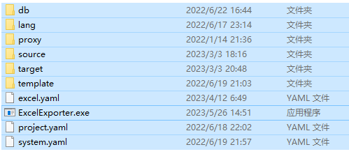
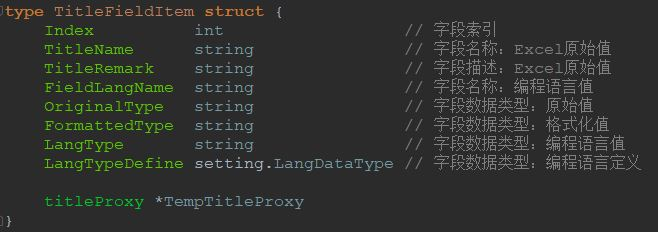
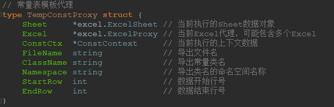
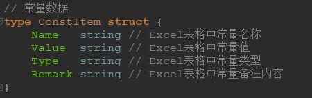
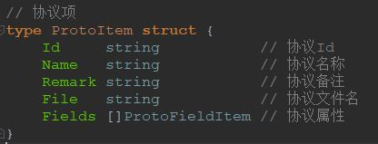
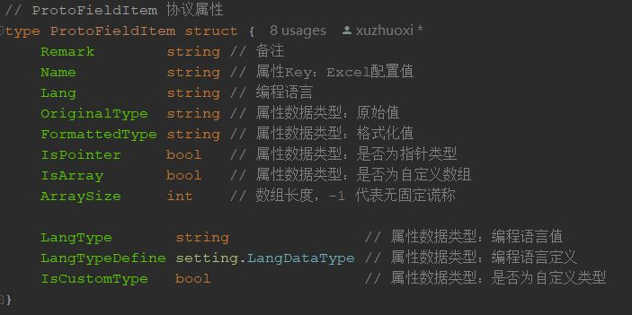
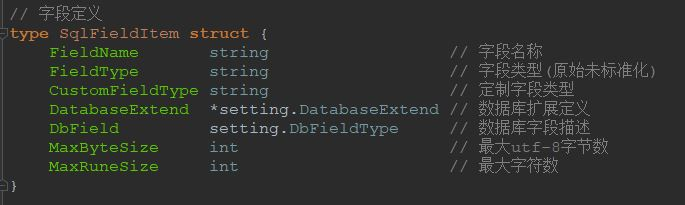

# ExcelExporter  
A Tool for exporting Excel data.  
Export Excel data according to templates. Supports **multiple data formats** and **any programming language**. **Multi-OS** support.  

[中文](README.md) | English   

## 1. Compatibility  
go 1.16.15  

## 2. How to get
The ExcelExporter tool can be obtained in the following two ways:  

#### 2.1. Download from Release.
   [Download page](https://github.com/xuzhuoxi/ExcelExporter/releases)
+ Download the executable file for the corresponding platform.  
+ Download environment configuration  

#### 2.2. Download the source code and compile it.  
Download the github source repository for compilation. Proceed as follows:  
1. Execute the following command to obtain the source code warehouse project.  
```
go get -u github.com/xuzhuoxi/ExcelExporter
```
2. Compile the project.  
+ Execute [goxc_build.bat](/build/goxc_build.bat) under Windows  
+ Execute [goxc_build.sh](/build/goxc_build.sh) under Linux or MacOS  

## 3. Start

#### 3.1. Environment preparation  
1. Unzip evn.zip to the local, and clean up the test files in soruce.  
2. Copy the executable file to the evn directory.  
    The directory structure under Windows is as follows:  
      
3. Execute the command.  

#### 3.2. Executing commands
```
ExcelExporter -env=%env% -mode=title,data,const,proto -range=client,server,db -lang=as3,c#,go,java,ts -file=json,bin,sql -merge=false -source==%sourcepath% -target=%exportpath%
```

**Example**:
1. Export the table header and data under the client range, the programming language used is c#, and the data file is exported as json.  
```shell
ExcelExporter -mode=client range=client -lang=c# -file=json
```
2. Export the sql table script and sql data script in the db range and merge them  
```shell
ExcelExporter -mode=title,data -range=db -file=sql -merge=true
```
3. Export the constant table and protocol table files under the client range, using the programming language go.  
```shell
ExcelExporter -mode=const,proto -range=client -lang=go
```

#### 3.3. Parameter description (required parameters with \*)

- -env  
   + Function: Re-specify the environment configuration.  
   + Optional: if not specified, the environment configuration under the execution file directory will be used  

- **-mode \***  
   + Role: specify the running mode, multiple modes can be separated by commas ","  
   + supports:  
     + title:  
       Title Export  
       Subsequent parameter requirements: -range, -lang, -file, -merge  
     + data:  
       Data output  
       Subsequent parameter requirements: -range, -file, -merge  
     + const:  
       Const Export  
       Subsequent parameter requirements: -range, -lang  
     + proto:  
       Proto export  
       Subsequent parameter requirements: -range, -lang  

- **-range \***  
   + Role: Specify the field range or filter protocol when exporting the table header or data  
   + **Supported values**: client, server, db  
   + **Applicable modes**: title, data, const, proto  
     + title, data  
       Specify the header or field range when exporting data.  
       Specifies the associated directory for exported files.  
     + const  
       Specifies the associated directory for exported files.  
     + proto  
       Select the protocol table to export.  
       Specifies the associated directory for exported files.  

- **-lang \***  
   + Role: specify the relevant compilation language, multiple commas can be separated by ","  
   + **Supported values**: as3, c#, go, java, ts  
   + **Applicable modes**: title, const, proto  

- -file  
   + Role: Specify the format type of the exported data file, multiple commas can be separated by ","  
   + **Supported values**: json, bin, sql  
   + Incomplete support values: yaml, toml, hcl, env, properties  
   + **Applicable mode**: title, data  

- -merge  
   + Function: When -file contains sql, specify whether to merge the exported sql script. The default is flase.  
   + **Supported values**: true, false  

- -source  
   + Role: Specify the source directory of the Excel table at runtime, which is used to override the value of source.value in the configuration file project.yaml  
   + **Applicable modes**: title, data, const, proto  

- -target  
   + Role: Specify the file output directory at runtime, used to override the value of target.value in the configuration file project.yaml  
   + **Applicable modes**: title, data, const, proto  
   
## 4. Configuration file

### 4.1. Environment directory and file description  
<pre><code>. Configuration root directory
├── db: database related configuration and sql template
│ ├── mysql.yaml: mysql information configuration
│ ├── mysql_table.temp: mysql table creation template
│ ├── mysql_data.temp: mysql insert data template
│ ├── ...: other extensions
├── lang: programming language related configuration
│ ├── as3.yaml: For ActionScript3, the reading and writing syntax configuration of each basic data type under different data files
│ ├── c#.yaml: For c#, the configuration of the reading and writing syntax of each basic data type under different data files
│ ├── c++.yaml: For c++, the configuration of reading and writing syntax for each basic data type under different data files
│ ├── go.yaml: For golang, the configuration of read and write syntax for each basic data type under different data files
│ ├── java.yaml: For java, the configuration of the reading and writing syntax of each basic data type under different data files
│ ├── ts.yaml: For typescript, the reading and writing syntax configuration of each basic data type under different data files
│ ├── ...: In other programming languages, the reading and writing grammar configuration of each basic data type in different data files
├── proxy: proxy code set (not necessary)
│ ├── as: ActionScript3 related proxy code set
│ ├── go: Golang related proxy code set
│ ├── java: Java-related proxy code set
│ ├── ts: TypeScript related proxy code set
│ ├── ...: proxy code sets related to other programming languages
├── templates: template file directory, only supports golang template syntax
│ ├── as3_const.temp: Constant definition template in ActionScript3 language
│ ├── as3_proto.temp: Protocol definition template in ActionScript3 language
│ ├── as3_title.temp: Title definition template in ActionScript3 language
│ ├── c#_const.temp: constant definition template in C# language
│ ├── c#_proto.temp: Protocol definition template in C# language
│ ├── c#_title.temp: Title definition template in C# language
│ ├── go_const.temp: constant definition template in golang language
│ ├── go_proto.temp: protocol definition template in golang language
│ ├── go_title.temp: Title definition template in golang language
│ ├── java_const.temp: constant definition template in java language
│ ├── java_proto.temp: Protocol definition template in java language
│ ├── java_title.temp: Title definition template in java language
│ ├── ts_const.temp: Constant definition template in TypeScript language
│ ├── ts_proto.temp: Protocol definition template in TypeScript language
│ ├── ts_title.temp: Title definition template in TypeScript language
│ ├── ...: In other languages, constant definition templates and Title definition templates
├── source: default Excel file storage directory
├── target: default Excel file storage directory
├── excel.yaml: Excel header configuration, including data header configuration and constant header configuration
├── project.yaml: project configuration, including data source configuration, data output configuration, buffer configuration, big and small endian configuration, etc.
├── system.yaml: application configuration, including supported programming language configuration (extension, read and write configuration, template association, etc.), data field type configuration, data file configuration, etc.
</code></pre>  

### 4.2 [System Configuration](./res/system.yaml)  
Responsible for configuration related to basic functions: [system.yaml](./res/system.yaml)  

#### 4.2.1 Functional Scopes  
1. Programming language information configuration  
    + extension configuration  
    + Data type read and write behavior configuration  
    + related export template configuration  
2. Database information configuration  
    + Database field type mapping file configuration  
    + Template configuration of database table creation script  
    + Template configuration for database data scripts  
3. Basic data type configuration  
4. Export data file format configuration  

#### 4.2.2 Custom Occasions  
In the following situations, you should modify [system.yaml](./res/system.yaml)  
+ Extend or modify the programming language  
+ extend or modify database  
+ Extensions should support basic data types  
+ Extended data file formats to be supported  

### 4.3 [Project Configuration](./res/project.yaml)  
Responsible for project-related configuration: [project.yaml](./res/project.yaml)  

#### 4.3.1 Functional Scopes  
1. Data source configuration, including directory, extension, etc.  
2. Export information configuration, including:  
    + Export root configuration  
    + Export subdirectory configuration for client, server, db three field ranges in title, data, const, proto mode  
    + Subdirectory configuration when exporting sql.  
3. Cache settings while processing  

#### 4.3.2 Custom Occasions  
In the following situations, you should modify [project.yaml](./res/project.yaml)  
+ There is more than one Excel directory, and I want to process it in the same command. A path where source.value can be expanded.  
+ If you do not provide the -source parameter in the command line and want to customize the source directory of excel, you can modify the path of source.value.  
+ If you want to customize the input path of the file, you can modify the attributes in the target  

### 4.4 [Excel Configuration](./res/excel.yaml)  
Responsible for Excel-related configuration: [excel.yaml](./res/excel.yaml)  

#### 4.4.1 Functional Scopes  
1. Customize the file name prefix, which is ignored during processing  
2. Excel table configuration in title and data mode  
    + prefix: enable prefix configuration, adding processing for title and data modes.  
    + outputs: export information configuration, for the client, server, db three ranges, the coordinates of the exported information in Sheet  
    + sql: export information configuration, when exporting sql files for db, the export information coordinates in Sheet  
      + key: primary key information coordinates  
      + table: table name information coordinates  
      + file: script file name information coordinates  
    + control_row: **control row** row number, used to manage the processing range of the field (number of fields)  
    + nick_row: **Field Nickname** Row number, which is convenient for finding the format information of the specified unit in the template.  
    + name_row: **field name** row number  
    + remak_row: **field remark** row number  
    + range_row: **Field Applicable Range** row number, match against -range parameter  
    + data_type_row: **field datatype** row number, for values in field_datatypes in system.yaml  
    + sql_data_type_row: data type row number for sql  
    + ext_name_rows: programming language specific field name row number  
    + file_key_rows: data file dedicated field name row number  
    + data_start_axis: **data start** coordinates  
3. Excel table configuration in const mode  
    + prefix: **Enable prefix**, add processing for const mode.  
    + outputs: **export information**, for the two field ranges of client and server, the coordinates of the exported information in Sheet  
    + name_col: **constant name** column number  
    + value_col: **constant value** column number  
    + type_col: **constant value type** column number  
    + remark_col: **constant comment** column number  
    + data_start_row: **start row number**  
4. Excel table configuration in proto mode  
    + prefix: **Enable prefix**, add processing for proto mode.  
    + id_datatype: **Numerical type information of the protocol Id** coordinates, it is recommended to use int32 or string.  
    + range_name: **applicable range information** coordinates, match against -range parameter  
    + namespace: **namespace information** coordinates  
    + export: **export subdirectory information** coordinates  
    + id_col: **Id information** column number  
    + file_col: **export file name info** column number  
    + name_col: **export class name information** column number  
    + field_start_col: ** attribute start column number **  
    + data_start_row: **protocol data start row number**  
    + remark_offset: **protocol remark offset value**  
    + blank_break: **Whether blank lines break**  

#### 4.4.2 Custom Occasions  
In the following situations, you should modify [excel.yaml](./res/excel.yaml)  
+ Custom Excel source directory path  
+ Filter some Excel files in the source and target so that they do not participate in the processing.  
+ Adjust the position in the Sheet where the exported information is located, including directory, file name, namespace, etc.  

### 4.5 Programming language configuration  
The following uses the go language as an illustration.  

#### 4.5.1 Language Configuration  
+ configuration file location  
   + By default, the programming language configuration is located in the [res/lang](./res/lang) directory.  
   + Associated by the ref path of each item of languages in [system.yaml](./res.system.yaml).  
   + For example: go language configuration is located in [res/lang/go.yaml](./res/lang/go.yaml).  
+ Description of configuration properties  
   + lang_name: language name  
   + data_types:: data type configuration  
     + name: data type name  
     + operates: data type operation method name  
       + file_name: data file name  
       + get: value method  
       + set: set value method  
+ The types contained in the field_datatypes attribute in [system.ymal](./res/system.yaml) are configured in data_types in the configuration.  

#### 4.5.2 Template configuration  
+ template file location  
   + By default, the programming language configuration is located in the [res/template](./res/template) directory.  
   + The Title template is associated with the temps_title path of each language item in system.yaml.  
   + Const templates are associated with the temps_const path of each language item in system.yaml.  
   + The Proto template is associated with the temps_proto path of each language item in system.yaml.  
   + For example, the go language template is as follows:  
     + go_const.temp: [res/template/go_const.temp](./res/template/go_const.temp)  
     + go_proto.temp: [res/template/go_proto.temp](./res/template/go_proto.temp)  
     + go_title.temp: [res/template/go_title.temp](./res/template/go_title.temp)  
- Template files supported by golang syntax, help can be viewed [**https://golang.google.cn/pkg/text/template/**](https://golang.google.cn/pkg/text/template /)  

### 4.6 Database configuration instructions  
The following uses the mysql database as an illustration.  

#### 4.6.1 Configuration  
+ configuration file location  
   + By default, the programming language configuration is located in the [res/db](./res/db) directory.  
   + mysql.yaml is the data configuration file, which is associated with databases.list.ref in system.yaml.  
+ Description of configuration properties  
   + db_name: database name  
   + scale_char: Char character scale  
   + scale_varchar: Varchar character scale  
   + types: database data type description  

#### 4.6.2 Templates  
+ template file location  
   + By default, the programming language configuration is located in the [res/db](./res/db) directory.  
   + [mysql_data.temp](./res/db/mysql_data.temp) is the data script template, which is associated with databases.list.temps_data in system.yaml.  
   + [mysql_table.temp](./res/db/mysql_table.temp) is the table creation script template, which is associated with databases.list.temps_table in system.yaml.  
+ Template files supported by golang syntax, help can be viewed [**https://golang.google.cn/pkg/text/template/**](https://golang.google.cn/pkg/text/template /)

## 5. Functions

+ Four basic export functions:  
   + [**Title Export**](#5.1 Title Export), corresponding command parameter `-mode=title`  
   + [**Data Export**](#5.2 Data Export), corresponding to the command parameter `-mode=data`  
   + [**Const Export**](#5.3 Const Export), corresponding command parameter `-mode=const`  
   + [**Proto Export**](#5.4 Proto Export), corresponding to the command parameter `-mode=proto`  
+ Special export functions:  
   + [**Sql export**](#5.5 Sql export), corresponding to the command parameter `-mode=title` or `-mode-data`, `-fiel=sql`  

### 5.1 Title Export  
Export the header information in the Excel file as a data structure or class of the corresponding language  

#### 5.1.1 Title Export Processing Flow  
1. Traverse every matching Excel file in the source directory.  
     + The source directory is given by the soruce.value list in project.yaml.  
     + You can re-specify the source directory through the -source parameter.  
     + Match according to the soruce.ext_name list in project.yaml.  
2. Traverse the matched Sheets in the Excel file.  
     + Match according to the title&data.prefix attributes in excel.yaml.  
3. Select the corresponding field list according to the -range parameter.  
     + The -range parameter supports three types: client, server, and db. For details, please [view]().  
4. According to the -lang parameter, select the configuration and export template corresponding to the language.  
     + The -lang parameter supports go, as3, ts, java, c#, please [view]() for details.  
5. Field list => fields or properties of a data structure or class.  
6. The corresponding files are all generated into the target directory.  
     + The target root directory is given by the target.root list in project.yaml.  
     + The target.title in project.yaml in the header output directory is given as the relative path of target.root.  
     + You can re-specify the source directory through the -target parameter.  
     + According to the content of the -range parameter, the files are respectively generated into the directories corresponding to target.title.client, target.title.server, and target.title.database in project.yaml.  

#### 5.1.2 Header Template Description  
1. The injected data object is [\*TempTitelProxy](/src/core/context_title.go)  
    + Can be obtained through template syntax such as `{{.}}`, `{{$proxy := .}}`, and the structure is defined as:  
        

    + public properties or functions commonly used in templates:  
      + Excel : [\*excel.ExcelProxy](/src/core/excel/proxy.go)  
        The currently executing Excel data proxy object  
      + Sheet : [\*excel.ExcelSheet](/src/core/excel/sheet.go)  
        Currently executing Sheet data object  
      + TitleCtx : [\*TitleContext](/src/core/context_title.go)  
        Header context data of the current execution  
      + FileName: string  
        Title Export class file name  
      + ClassName : string  
        Title Export class name  
      + Namespace: string  
        Title Export class namespace  
      + FieldIndex : []int  
        The currently selected field index  
      + ValueAtAxis : string  
        Get the value of the specified cell on the current Sheet  
      + GetFields : \[\][TitleFieldItem](/src/core/context_title.go)  
        Get field information array  

2. The field object obtained by GetFields is [TitleFieldItem]((/src/core/context_title.go)  
    + structure definition  
        

    + public properties or functions commonly used in templates  
      + Index : int  
        field index  
      + TitleName: string  
        Field Name: Excel Raw Value  
      + TitleRemark : string  
        Field description: Excel original value  
      + FieldLangName: string  
        Field Name: Programming Language Value  
      + OriginalType: string  
        Field data type: primitive value  
      + FormattedType: string  
        Field data type: formatted value  
      + LangType: string  
        Field data type: programming language value  
      + LangTypeDefine: [setting.LangDataType](./src/setting/system_lang.go)  
        Field Data Types: Programming Language Definitions  

3. [Custom Function](#5.6.1 Custom Function)  

### 5.2 Data Export
- Supported data export formats: bin (binary), json, sql.  
- When yaml, toml, hcl, env, properties data is exported, the field name will be **forced** to be lowercase, the original intention requires **case dependent**, not open by default  
- To enable data export such as yaml, please modify the system.yaml file and add it to the "datafiel_formats" list.  

### 5.3 Const Export

#### 5.3.1 Const Export Processing Flow
1. Traverse every matching Excel file in the source directory.  
    + The source directory is given by the soruce.value list in project.yaml.  
    + You can re-specify the source directory through the -source parameter.  
    + Match according to the soruce.ext_name list in project.yaml.  
2. Traverse the matched Sheets in the Excel file.  
    + Match according to the const.prefix property in excel.yaml.  
    + According to the name_col, value_col, type_col, and remark_col in excel.yaml, locate the name, value, type, and comment of the constant.  
    + According to the data_start_row in excel.yaml, start to describe the data until the end of the last row, and ignore the empty row.  
3. According to the -lang parameter, select the configuration and export template corresponding to the language.  
    + The -lang parameter supports go, as3, ts, java, c#, please [view]() for details.  
4. All corresponding files are generated into the target directory.  
    + The target root directory is given by the target.root list in project.yaml.  
    + The target.const in project.yaml in the constant table output directory is given, which is the relative path of target.root.  
    + You can re-specify the root directory through the -target parameter.  
    + According to the content of the -range parameter, the files are generated into the directories corresponding to target.const.client and target.const.server in project.yaml respectively.  

#### 5.3.2 Description of Const Export Template  
1. The injected data object is [\*TempConstProxy](/src/core/context_const.go)  
    + Can be obtained through template syntax such as `{{.}}`, `{{$proxy := .}}`, and the structure is defined as:  
      

    + public properties or functions commonly used in templates:  
      - Excel : [\*excel.ExcelProxy](/src/core/excel/proxy.go)  
        The currently executing Excel data proxy object  
      - Sheet : [\*excel.ExcelSheet](/src/core/excel/sheet.go)  
        Currently executing Sheet data object  
      - ConstCtx : [\*ConstContext](/src/core/context_const.go)  
        context data for the current execution  
      - FileName : string  
        export file name  
      - ClassName : string  
        export constant class name  
      - Namespace: string  
        The namespace name of the exported class name  
      - StartRow : int  
        Data start line number  
      - EndRow : int  
        Data end line number  
      - ValueAtAxis : string  
        Get the value of the specified cell on the current Sheet  
      - GetItems : \[\][ConstItem](/src/core/context_const.go)  
        Get field information array  
2. The field object obtained by GetItems is [ConstItem]((/src/core/context_const.go)  
    + structure definition  
        

    + public properties or functions commonly used in templates  
      + Name : int  
        Constant name in Excel sheet  
      + Value : string  
        Constant values in Excel tables, strings have been processed with double quotes  
      + Type : string  
        Constant type in Excel table  
      + Remark : string  
        Contents of constant remarks in the Excel table  
   
3. [Custom Function](#5.6.1 Custom Function)  

### 5.4 Proto Export

#### 5.4.1 Proto Export Processing Flow
1. Traverse every matching Excel file in the source directory.  
    + The source directory is given by the soruce.value list in project.yaml.  
    + You can re-specify the source directory through the -source parameter.  
    + Match according to the soruce.ext_name list in project.yaml.  
2. Traverse the matched Sheets in the Excel file.  
    + Matches according to the proto.prefix property in excel.yaml.  
    + Locate the Id and start attributes of the protocol according to proto.id_col and proto.field_start_col in excel.yaml.  
    + According to proto.data_start_row in excel.yaml, start to describe the data positively, until it ends with a blank row.  
3. According to the -lang parameter, select the configuration and export template corresponding to the language.  
    + The -lang parameter supports go, as3, ts, java, c#, please [view]() for details.  
4. All corresponding files are generated into the target directory.  
    + The target root directory is given by the target.root list in project.yaml.  
    + The target.proto in project.yaml in the output directory of the constant table is given, which is the relative path of target.root.  
    + You can re-specify the root directory through the -target parameter.  
    + According to the content of the -range parameter, the files are respectively generated into the directories corresponding to target.prot.client and target.proto.server in project.yaml.  

#### 5.4.2 Proto export Template Description  
1. The injected data object is [\*TempProtoProxy](/src/core/context_proto.go)  
    + Can be obtained through template syntax such as `{{.}}`, `{{$proxy := .}}`, and the structure is defined as:  
      
      

    + public properties or functions commonly used in templates:  
      - ProtoItem : [\*ProtoItem](src/core/context_proto.go)  
        The currently executing Excel data proxy object  
      + SheetProxy : [\*ProtoSheetProxy](src/core/context_proto.go)  
        Currently executing Sheet data object  
      + ValueAtAxis : string  
        Get the value of the specified cell on the current Sheet  
      + Namespace: string  
        The namespace name of the exported class  
      + ProtoId: string  
        ProtocolId  
      + ProtoIdDataType: string  
        The data type corresponding to the protocol Id  
      + ClassName : string  
        export class name  
      + ClassRemark : string  
        export class name  
      + GetFields : \[\][ProtoFieldItem](/src/core/context_proto.go)  
        Get field information array  
   
2. The field object obtained by GetItems is [ProtoFieldItem]((/src/core/context_const.go)  
    + structure definition  
        

    + public properties or functions commonly used in templates  
      + Remark : int  
        Remark  
      + Name : string  
        Attribute Key: Excel configuration value  
      + OriginalType : string  
        Attribute Data Type: Primitive Value  
      + FormattedType : string  
        Attribute Data Type: Formatted Value  
      + LangType : string  
        Property Data Type: Programming Language Value  
      + LangTypeDefine : string  
        Attribute Data Types: Programming Language Definition  
      + IsCustomType : string  
        Attribute data type: whether it is a custom type  

3. [Custom Function](#5.6.1 Custom Function)  

### 5.5 Sql Export

#### 5.5.1 Sql Export Processing Flow
+ **Sql export depends on the settings of Title Export and data export. **  
+ When the following three conditions **consist at the same time**, perform sql export.
   + -ragne contains the db item  
   + -file contains sql items  
   + -mode contains at least one of title or data.  
+ Export process:  
   1. Traversing Excel files and Sheets is consistent with [**Title Export**](#Title Export) and [**Data Export**](#Data Export).  
   2. When the -merge parameter is set to true, only one sql file (all_merge.sql) will be produced  
   3. When the -merge parameter is turned off or set to false, "filename.talbe.sql" and "filename.data.sql" will be generated, the table.sql file is the table structure update script, and data.sql is the data update script.  

#### 5.5.2 Sql Export Template Description
1. The injected data object is [\*TempSqlProxy](/src/core/context_sql.go)
    + Can be obtained through template syntax such as `{{.}}`, `{{$proxy := .}}`, and the structure is defined as:  
      
      
   
    + public properties or functions commonly used in templates:  
      + Excel:[\*excel.ExcelProxy](/src/core/excel/proxy.go)  
        The currently executing Excel data proxy object  
      + Sheet:[\*excel.ExcelSheet](/src/core/excel/sheet.go)  
        Currently executing Sheet data object  
      + SqlCtx:[\*SqlContext](/src/core/context_sql.go)  
        The currently executing Sql context  
      + TableName: string  
        database table name  
      + FieldIndex: string  
        field selection index  
      + StartRow: string  
        start line number  
      + EndRow : int  
        end line number  
      + StartColIndex : int  
        start column index  
      + ValueAtAxis : string  
        Get the value of the specified cell on the current Sheet  
      + PrimaryKeyLen : int  
        number of primary keys  
      + GetPrimaryKeys : \[\][SqlFieldItem](/src/core/context_sql.go)  
        Get primary key information  
      + GetFieldItems : \[\][SqlFieldItem](/src/core/context_sql.go)  
        Get a list of field information  
      + GetItems : \[\][SqlFieldItem](/src/core/context_sql.go)  
        Get data information list  

2. [Custom Function](#5.6.1 Custom Function)

### 5.6 Template Customization
The template file format is a go language template, and the document description address is as follows:  
[https://golang.google.cn/pkg/text/template/](https://golang.google.cn/pkg/text/template/)  

#### 5.6.1 Custom Functions
Custom functions are valid for all templates  
**Note**: The return value of the custom function must be 1 or 2, which is an official requirement.  
When there are 2 return values, the second return value type must be error.  

- [ToLowerCamelCase](/src/core/tools/naming.go)  
  Convert the string content to **Small Camelcase** format  

- [ToUpperCamelCase](/src/core/tools/naming.go)  
  Convert the string content to **Big CamelCase** format 

- [Add](/src/core/tools/math.go)  
  addition  

- [Sub](/src/core/tools/math.go)  
  subtraction  

- [NowTime](/src/core/tools/time.go)  
  get current time  

- [NowTimeStr](/src/core/tools/time.go)  
  Get the current time default format string  

- [NowTimeFormat](/src/core/tools/time.go)  
  get current time  
  **2006-01-02 15:04:05 PM Mon Jan**  
  **2006-01-\_2 15:04:05 PM Mon Jan**  

- [NowYear](/src/core/tools/time.go)  
  current time year  

- [NowMonth](/src/core/tools/time.go)  
  current month  
  January: 1  

- [NowDay](/src/core/tools/time.go)  
  current date and time  

- [NowWeekday](/src/core/tools/time.go)  
  current day of the week  
  Sunday: 0  

- [NowHour](/src/core/tools/time.go)  
  current hour  

- [NowMinute](/src/core/tools/time.go)  
  Current time in minutes  

- [NowSecond](/src/core/tools/time.go)  
  current time in seconds  

- [NowUnix](/src/core/tools/time.go)  
  Current timestamp (s)  

- [NowUnixNano](/src/core/tools/time.go)  
  current timestamp (ns)  

## 6. Dependencies
- infra-go (library dependency) [https://github.com/xuzhuoxi/infra-go](https://github.com/xuzhuoxi/infra-go)  
- excelize (library dependency) [https://github.com/360EntSecGroup-Skylar/excelize](https://github.com/360EntSecGroup-Skylar/excelize)  
- goxc (compilation dependencies) [https://github.com/laher/goxc](https://github.com/laher/goxc)  

## 7. Contact The Author  
xuzhuoxi  
<xuzhuoxi@gmail.com> or <mailxuzhuoxi@163.com>  

## 8. License  
ExcelExporter source code is open source based on [MIT license](/LICENSE).  